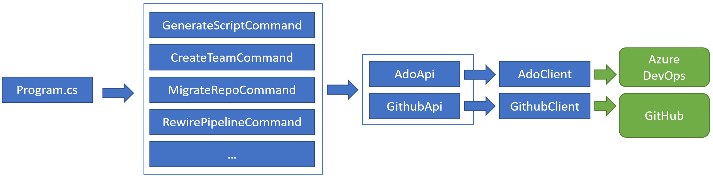

## Navigating the code
We use C# 9 and .Net 5.x (soon to upgrade to C# 10 + .Net 6.x).

The application is split up into a Console App per source technology (e.g. github, ado, bitbucket, etc) + Class Library for shared code.

When the CLI is executed the flow of execution is:



1. Program.cs - sets up some plumbing/infrastructure. It uses System.CommandLine library to parse the command-line args and invoke the appropriate command class. It also sets up dependency injection.

2. Commands - For every command the CLI supports there is a XXXCommand class. This class is responsible for defining the various options/args supported by that command, and most of the implementation logic.

3. AdoApi/GithubApi - (and eventually classes for Bitbucket/GitLab/etc) is a bunch of small functions that wrap ADO/GitHub API's (one function per API). They encapsulate the details about the endpoint URL, the request payload, and how to parse the response.

4. AdoClient/GithubClient - A wrapper over HttpClient that implements some helper logic that is not specific to any single API. E.g. paging through results, setting authorization headers, handling throttling/retries, etc.

## Testing
All tests must run and pass on every PR.

### Unit Tests
For unit testing we use XUnit.Net and Moq.

Pretty much all code should be covered by unit tests. Any new code should come with appropriate unit tests in the same PR.

### Integration Tests
In addition there are a small number of End-to-End integration tests (still a work in progress), that will run actual migrations against ADO/GitHub.

**WARNING:** Running the integration tests locally will crash any CI integration test actions that are in progress and result in unexpected behavior, so wait until any in progress actions finish first.

1. First make sure your environment variables are set:
    ```
    export ADO_PAT=<pat_found_in_1password>
    export GH_PAT=<pat_found_in_1password>
    ```
2. Build the binary with publish.ps1 (needs PowerShell) or copy the build command from publish.ps1:
    ```bash
    pwsh
    ```
    ```powershell
    > ./publish.ps1
    > exit
    ```
3. Install the gh gei extension using the new binary:
    ```bash
    mkdir gh-gei
    # Copy the binary from wherever it's located, for ex:
    cp ./dist/linux-x64/gei-linux-amd64 ./gh-gei/gh-gei
    cd gh-gei
    gh extension install .
    cd ..
    ```
4. Run the integration tests, either use the Test Runner in Visual Studio, or run the command:
    ```
    dotnet test src/OctoshiftCLI.IntegrationTests/OctoshiftCLI.IntegrationTests.csproj
    ```

Running e2e tests locally isn't supported yet, to run these you can create a draft PR.

## Static Analysis
There are 3 types of static analysis that are enforced on every PR:
1. Roslyn analyzers - These enforce various coding standards and design patterns. If you use Visual Studio this will automatically run on build and generate warnings. On PR those warnings will be treated as errors. Note: There are some roslyn rules that run in Visual Studio but not in the PR build (only because we haven't figured out how to run them from Actions yet). Please also ensure these are all passing. If a rule is determined to be causing more pain than value they can be turned off in src/.editorconfig (Note: any changes to this file will get extra scrutiny). Our approach has been to start by turning on more rules than we probably should, and selectively turn them off as we encounter ones that aren't providing much value.

2. CodeQL - This is run on every PR and checks for any potential security or quality issues in the code. As with the Roslyn analyzers we have defaulted to turning on most rules, and will turn some off over time if needed. CodeQL rules can be turned off in .github/codeql/csharp-custom-queries.qls. It should possible to run CodeQL locally by following [this guide](https://codeql.github.com/docs/codeql-cli/getting-started-with-the-codeql-cli/). In the future we will setup a Codespaces container that makes this easier to get going. You can also create a draft PR to run a CodeQL scan.

3. dotnet format - This is a style/formatting check. To ensure we follow consistent code formatting you should run `dotnet format` locally before creating a PR. If the PR build fails on dotnet format it's almost certainly because you didn't run dotnet format before committing.

## Publishing a Release
Only repo maintainers can publish a release. The process is kicked off by pushing a tag in the format `v0.7`. We follow [Semantic Versioning](https://semver.org/) when deciding on the next version number.

This will trigger an Actions workflow that results in a new release being published. It performs these steps:
- Validates that the SHA referenced by the tag is in the history of the `main` branch
- Runs `publish.ps1` to build self-contained binaries for each platform. This script also embeds the version number (extracted from the tag) into each binary.
- Creates a release in this repo with the self-contained binaries, uses the contents of `RELEASENOTES.md` as the release description.
- Moves the contents of `RELEASENOTES.md` to a version specific file under the releasenotes folder, then empties out `RELEASENOTES.md` and commits the 2 files

## Development Basics

You can try developing this repo using GitHub codespaces, so all the dependencies are installed for you!

Check out `publish.ps1` to see how binaries are built for this repo for various distributions.

Build with:
```bash
dotnet build src/OctoshiftCLI.sln
```

Alternatively, you can use for gei
```bash
 dotnet watch build --project  src/gei/gei.csproj
```
to run builds automatically.
- If you're doing this, you can run the binaries with `./src/gei/bin/Debug/net6.0/gei`

If you aren't using watch, run **after** building with:
```bash
dotnet run --project src/gei/gei.csproj
```

Run tests with
```bash
dotnet test src/OctoshiftCLI.Tests/OctoshiftCLI.Tests.csproj
```

Format your files locally with:
```bash
dotnet format src/OctoshiftCLI.sln
```

### Good to Knows

When you add a new parameter, the name of the argument in the invoke function has to match the name of the parameter.

### Pull Requests from non-maintainers

If somebody who is not a maintainer on this repo submits a PR the CI build will fail because of permissions/secrets issues. We can probably improve this in the future, but for now a workaround is for somebody who is a maintainer to do this:
```
git fetch origin pull/263/head:pr263
git checkout -b dylan-smith/external-pr-263 pr263
git push -u origin dylan-smith/external-pr-263
```
where 263 is the PR number. After running these commands create a draft PR with the new branch (`dylan-smith/external-pr-263` in this example). The new draft PR will run CI successfully, and the success (or failure) will show up on both the new draft PR and the original PR from the external contributor.
